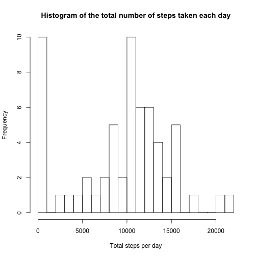

###Loading and preprocessing the data

```r
setwd("~/Documents/Programming/datasciencecoursera/Reproducible_Research")
#Load the data;
activity<-read.csv("activity.csv", header=T)
```

###What is mean total number of steps taken per day?
1. Calculate the total number of steps taken per day.

```r
tot_steps_per_day<-tapply(activity$steps, activity$date, sum, na.rm=T)
tot_steps_per_day
```

```
## 2012-10-01 2012-10-02 2012-10-03 2012-10-04 2012-10-05 2012-10-06 
##          0        126      11352      12116      13294      15420 
## 2012-10-07 2012-10-08 2012-10-09 2012-10-10 2012-10-11 2012-10-12 
##      11015          0      12811       9900      10304      17382 
## 2012-10-13 2012-10-14 2012-10-15 2012-10-16 2012-10-17 2012-10-18 
##      12426      15098      10139      15084      13452      10056 
## 2012-10-19 2012-10-20 2012-10-21 2012-10-22 2012-10-23 2012-10-24 
##      11829      10395       8821      13460       8918       8355 
## 2012-10-25 2012-10-26 2012-10-27 2012-10-28 2012-10-29 2012-10-30 
##       2492       6778      10119      11458       5018       9819 
## 2012-10-31 2012-11-01 2012-11-02 2012-11-03 2012-11-04 2012-11-05 
##      15414          0      10600      10571          0      10439 
## 2012-11-06 2012-11-07 2012-11-08 2012-11-09 2012-11-10 2012-11-11 
##       8334      12883       3219          0          0      12608 
## 2012-11-12 2012-11-13 2012-11-14 2012-11-15 2012-11-16 2012-11-17 
##      10765       7336          0         41       5441      14339 
## 2012-11-18 2012-11-19 2012-11-20 2012-11-21 2012-11-22 2012-11-23 
##      15110       8841       4472      12787      20427      21194 
## 2012-11-24 2012-11-25 2012-11-26 2012-11-27 2012-11-28 2012-11-29 
##      14478      11834      11162      13646      10183       7047 
## 2012-11-30 
##          0
```

2. Histogram of the total number of steps taken each day. The max tot steps/day is 21194, thus set the breaks=21194/1000 + 1= 23. 


```r
hist(tot_steps_per_day, breaks=23,main="Histogram of the total number of steps taken each day", xlab="Total steps per day")
```

 

3. Calculate and report the mean and median of the total number of steps taken per day.

```r
#MEAN of the the total number of steps taken per day.
mean1<-mean(tot_steps_per_day, na.rm=T)
#MEDIAN of the the total number of steps taken per day.
median1<-median(tot_steps_per_day, na.rm=T)
```
The mean and median of the total number of steps taken per day is 9354.2295082 and 10395, respectively.

###What is the average daily activity pattern?
1. Make a time series plot (i.e. type = "l") of the 5-minute interval (x-axis) and the average number of steps taken, averaged across all days (y-axis)

```r
ave_steps_5min<-tapply(activity$steps,activity$interval, mean, na.rm=T)
plot(as.numeric(names(ave_steps_5min)), ave_steps_5min, type="l", xlab="5 minute interval each day", ylab="Average steps taken", main="Average number of steps taken every 5-minute interval per day")
```

 

2. Which 5-minute interval, on average across all the days in the dataset, contains the maximum number of steps?

```r
D<-data.frame(interval=as.numeric(names(ave_steps_5min)), ave_steps=ave_steps_5min)
interval_num<-D[D$ave_steps==max(ave_steps_5min), 1]
interval_num
```

```
## [1] 835
```
The 835th 5-minute interval, on average across all the days contains the maximum number of steps.

###Imputing missing values
1. Calculate and report the total number of missing values in the dataset (i.e. the total number of rows with NAs)

```r
N_missing<-sum(!complete.cases(activity))
N_missing
```

```
## [1] 2304
```
There are total 2304 missing values in the dataset.

2. Devise a strategy for filling in all of the missing values in the dataset. The strategy does not need to be sophisticated. For example, you could use the mean/median for that day, or the mean for that 5-minute interval, etc.

Using dplyr package.


3. Create a new dataset that is equal to the original dataset but with the missing data filled in.

```r
updated_activity<-arrange(bind_rows(Valid_Part, newer_misssing_activity), date, interval)
```

4. Make a histogram of the total number of steps taken each day and Calculate and report the mean and median total number of steps taken per day. Do these values differ from the estimates from the first part of the assignment? What is the impact of imputing missing data on the estimates of the total daily number of steps?

```r
#generate the new total steps per day based on the imputed dataset.
new_tot_steps_per_day<-updated_activity %>%
  group_by(date) %>%
  summarise(steps_total=sum(steps)) %>%
  select(steps_total)
```

Histogram of the total number of steps taken each day for the imputed dataset.

```r
hist(new_tot_steps_per_day$steps_total, breaks=23,main="Histogram of the total number of steps taken each day (imputed)", xlab="Total steps per day")
```

 

Calculate the mean and median of the total number of steps taken per day for the imputed dataset.

```r
#MEAN of the the total number of steps taken per day.
mean2<-mean(new_tot_steps_per_day$steps_total)
#MEDIAN of the the total number of steps taken per day.
median2<-median(new_tot_steps_per_day$steps_total)
```
The mean and median of the total number of steps taken per day is 1.0766189 &times; 10<sup>4</sup> and 1.0766189 &times; 10<sup>4</sup>, respectively.

The above values were differed from the estimates from the first part of the assignment. The newer mean value increased a lot after the imputation which minimized the difference between the new mean and median value.

###Are there differences in activity patterns between weekdays and weekends?
1. Create a new factor variable "category" in the dataset with two levels – “weekday” and “weekend” indicating whether a given date is a weekday or weekend day.

```r
updated_activity_categorized<-updated_activity %>%
  mutate(WD=weekdays(as.Date(date)))
  
week_days<-mutate(updated_activity_categorized[!(updated_activity_categorized$WD %in% c("Sunday", "Saturday")), ], category="weekday")
weekend_days<-mutate(updated_activity_categorized[updated_activity_categorized$WD %in% c("Sunday", "Saturday"), ], category="weekend")

updated_activity_categorized<-arrange(bind_rows(week_days, weekend_days), date)
```

2. Make a panel plot containing a time series plot (i.e. type = "l") of the 5-minute interval (x-axis) and the average number of steps taken, averaged across all weekday days or weekend days (y-axis). See the README file in the GitHub repository to see an example of what this plot should look like using simulated data.

```r
library(ggplot2)
cat_plot<-updated_activity_categorized %>%
  group_by(category, interval) %>%
  summarise(ave_steps=mean(steps))
qplot(data=cat_plot,x=interval, y=ave_steps, facets=category~., geom="line", xlab="Intervals each day", ylab="Average steps")
```

 
